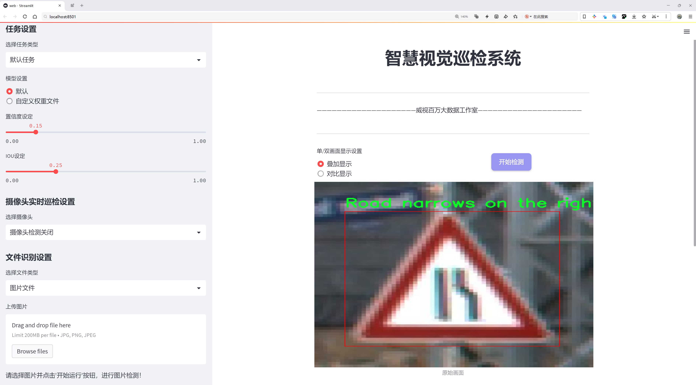
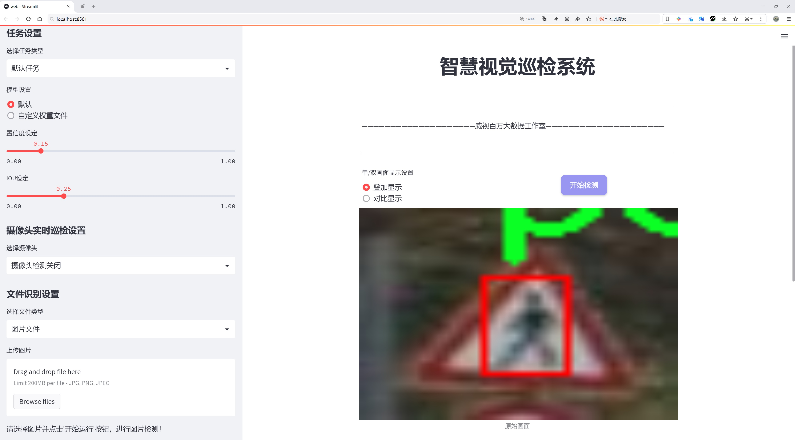
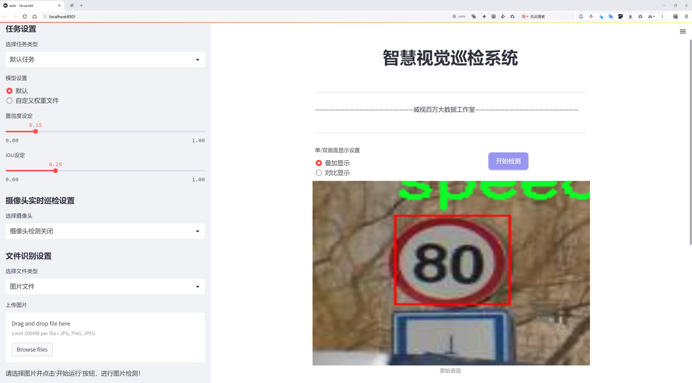
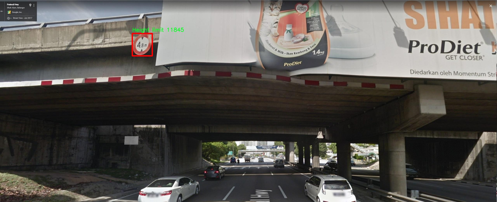
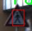
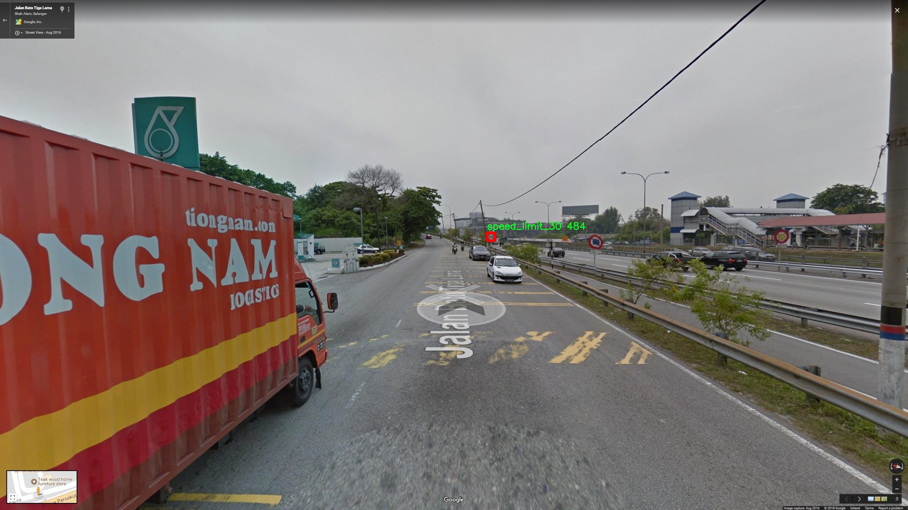
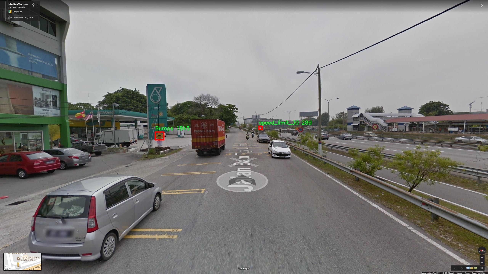

# 马来西亚交通标志检测检测系统源码分享
 # [一条龙教学YOLOV8标注好的数据集一键训练_70+全套改进创新点发刊_Web前端展示]

### 1.研究背景与意义

项目参考[AAAI Association for the Advancement of Artificial Intelligence](https://gitee.com/qunshansj/projects)

项目来源[AACV Association for the Advancement of Computer Vision](https://gitee.com/qunmasj/projects)

研究背景与意义

随着城市化进程的加快和机动车数量的不断增加，交通安全问题日益凸显。交通标志作为道路交通管理的重要组成部分，对保障交通安全、提高道路通行效率具有不可或缺的作用。尤其在马来西亚，交通标志的种类繁多，涵盖了从限速、行车指引到警告标志等87个类别，构成了复杂的交通环境。因此，如何高效、准确地识别和检测这些交通标志，成为了交通管理与智能交通系统研究的重要课题。

近年来，深度学习技术的迅猛发展为计算机视觉领域带来了革命性的变化，尤其是目标检测技术的进步，使得交通标志的自动识别成为可能。YOLO（You Only Look Once）系列模型以其高效的实时检测能力和较高的准确率，成为了目标检测领域的热门选择。YOLOv8作为该系列的最新版本，进一步优化了模型结构和算法性能，能够在复杂的交通场景中实现快速而准确的标志检测。然而，现有的YOLOv8模型在特定场景下仍然存在一定的局限性，尤其是在多样化的交通标志类别和复杂的环境条件下，检测效果有待提升。

本研究旨在基于改进的YOLOv8模型，构建一个适用于马来西亚交通标志检测的系统。通过对9600张包含87类交通标志的图像数据集进行训练和测试，研究将重点关注模型在不同类别标志识别上的表现，探索如何通过数据增强、模型优化等手段，提高模型的泛化能力和准确性。特别是在马来西亚特有的交通标志环境中，如何应对不同光照、天气和道路条件下的检测挑战，将是本研究的重要内容。

此外，交通标志检测系统的构建不仅有助于提升交通管理的智能化水平，也为未来的自动驾驶技术提供了基础支持。通过实现对交通标志的精准识别，能够为自动驾驶车辆提供实时的道路信息，增强其决策能力，从而提高行车安全性。随着智能交通系统的不断发展，交通标志检测技术的应用前景广阔，能够有效降低交通事故发生率，提升道路通行效率，具有重要的社会和经济意义。

综上所述，本研究在马来西亚交通标志检测领域具有重要的理论和实践价值。通过改进YOLOv8模型，结合丰富的交通标志数据集，探索高效的检测方法，不仅能够为交通管理提供技术支持，也为智能交通系统的进一步发展奠定基础。这一研究将为提升交通安全、优化交通管理提供新的思路和解决方案，具有深远的社会影响。

### 2.图片演示







##### 注意：由于此博客编辑较早，上面“2.图片演示”和“3.视频演示”展示的系统图片或者视频可能为老版本，新版本在老版本的基础上升级如下：（实际效果以升级的新版本为准）

  （1）适配了YOLOV8的“目标检测”模型和“实例分割”模型，通过加载相应的权重（.pt）文件即可自适应加载模型。

  （2）支持“图片识别”、“视频识别”、“摄像头实时识别”三种识别模式。

  （3）支持“图片识别”、“视频识别”、“摄像头实时识别”三种识别结果保存导出，解决手动导出（容易卡顿出现爆内存）存在的问题，识别完自动保存结果并导出到tempDir中。

  （4）支持Web前端系统中的标题、背景图等自定义修改，后面提供修改教程。

  另外本项目提供训练的数据集和训练教程,暂不提供权重文件（best.pt）,需要您按照教程进行训练后实现图片演示和Web前端界面演示的效果。

### 3.视频演示

[3.1 视频演示](https://www.bilibili.com/video/BV1rktQeVEF8/)

### 4.数据集信息展示

##### 4.1 本项目数据集详细数据（类别数＆类别名）

nc: 90
names: ['Bicycle lane', 'Bumps', 'Bumps ahead', 'Bus stop', 'Camera operation zone', 'Caution construction works ahead', 'Caution damaged roads', 'Caution drive slowly', 'Caution flagman ahead', 'Caution heavy vehicles entering and exiting construction zone ahead', 'Chevron -left-', 'Chevron -right-', 'Children', 'Cow nearby', 'Crossroad', 'Crossroad on the left', 'Crossroad on the right', 'Crosswind area', 'Danger Ahead', 'Detourfollow arrow', 'Double Bend to Left Ahead', 'Double Bend to Right Ahead', 'Expressway signs 1', 'Expressway signs 2', 'Flagman ahead', 'Give way', 'Heavy vehicles- keep left', 'Height limit', 'Left Bend Ahead', 'Left bend', 'Level crossing with gates ahead', 'Motorcycles only', 'Narrow bridge', 'No Stopping', 'No U-turns', 'No entry', 'No left turn', 'No motorcyclists', 'No overtaking', 'No parking', 'No right turn', 'Obstruction', 'Other dangers nearby', 'Parking area', 'Pass either side', 'Pass on the left', 'Pass on the right', 'Right Bend Ahead', 'Road cones', 'Road narrows on the left', 'Road narrows on the right', 'Road work', 'Roadway diverges', 'Roundabout ahead', 'Slippery Road', 'Slippery road', 'Speed Limit -60 kmph-', 'Speed limit', 'Stacked crossroad junctions', 'Stop', 'T-junction', 'Towing area', 'Traffic from Left Merges Ahead', 'Traffic from Right Merges Ahead', 'Traffic merging from the left', 'Traffic merging from the right', 'Traffic merging to the left', 'Traffic signals ahead', 'Train Gate', 'Two-way traffic', 'U turn', 'Weight limit', 'Width limit', 'Zebra crossing', 'pedestrian crossing opt1', 'speed_limit_10', 'speed_limit_100', 'speed_limit_110', 'speed_limit_120', 'speed_limit_15', 'speed_limit_20', 'speed_limit_30', 'speed_limit_35', 'speed_limit_40', 'speed_limit_5', 'speed_limit_50', 'speed_limit_60', 'speed_limit_70', 'speed_limit_80', 'speed_limit_90']


##### 4.2 本项目数据集信息介绍

数据集信息展示

在构建改进YOLOv8的马来西亚交通标志检测系统的过程中，使用了一个名为“malaysia traffic sign”的数据集。该数据集包含90个不同类别的交通标志，旨在为自动驾驶和交通管理系统提供准确的视觉识别能力。随着城市化进程的加快和交通流量的增加，交通标志的有效识别显得尤为重要。该数据集的设计考虑到了马来西亚特有的交通环境和标志系统，确保了模型在实际应用中的有效性和可靠性。

数据集中包含的类别涵盖了各种交通场景和指示信息。例如，“Bicycle lane”类别为骑行者提供了专用通道的指示，而“Bus stop”则指示公共交通的停靠点。这些类别不仅包括常见的交通标志，如“Stop”和“No entry”，还涵盖了更为复杂的情况，如“Traffic merging from the left”和“Traffic from Right Merges Ahead”，这些标志在繁忙的交叉口和道路分流处尤为重要。

此外，数据集还包括多种警告标志，如“Caution construction works ahead”和“Danger Ahead”，这些标志能够提醒驾驶员注意潜在的危险和道路状况，帮助提高行车安全性。通过识别这些标志，系统能够实时提供驾驶建议，减少事故发生的可能性。

数据集中的“Speed Limit”类别尤为重要，涵盖了从“speed_limit_5”到“speed_limit_120”的多个速度限制标志。这些标志对于维护道路安全和流量管理至关重要，能够有效引导驾驶员遵守交通规则，降低超速行驶的风险。

“malaysia traffic sign”数据集的设计不仅考虑了交通标志的多样性，还注重了标志的可识别性和实用性。每个类别的标志都经过精心挑选，确保其在不同光照和天气条件下的可见性。数据集的丰富性和多样性为YOLOv8模型的训练提供了坚实的基础，使其能够在复杂的交通环境中进行高效的标志检测。

在实际应用中，该数据集的训练结果将有助于提升交通标志识别的准确性和速度，进而推动智能交通系统的发展。通过不断优化和改进模型，未来的交通管理将更加智能化，能够实时响应交通状况，提升城市交通的整体效率。

总之，“malaysia traffic sign”数据集为马来西亚的交通标志检测系统提供了全面而丰富的训练数据，确保了系统在多样化交通场景中的有效性和可靠性。随着技术的不断进步，基于该数据集的研究将为未来的智能交通解决方案奠定坚实的基础。










### 5.全套项目环境部署视频教程（零基础手把手教学）

[5.1 环境部署教程链接（零基础手把手教学）](https://www.ixigua.com/7404473917358506534?logTag=c807d0cbc21c0ef59de5)


[5.2 安装Python虚拟环境创建和依赖库安装视频教程链接（零基础手把手教学）](https://www.ixigua.com/7404474678003106304?logTag=1f1041108cd1f708b01a)

### 6.手把手YOLOV8训练视频教程（零基础小白有手就能学会）

[6.1 手把手YOLOV8训练视频教程（零基础小白有手就能学会）](https://www.ixigua.com/7404477157818401292?logTag=d31a2dfd1983c9668658)

### 7.70+种全套YOLOV8创新点代码加载调参视频教程（一键加载写好的改进模型的配置文件）

[7.1 70+种全套YOLOV8创新点代码加载调参视频教程（一键加载写好的改进模型的配置文件）](https://www.ixigua.com/7404478314661806627?logTag=29066f8288e3f4eea3a4)

### 8.70+种全套YOLOV8创新点原理讲解（非科班也可以轻松写刊发刊，V10版本正在科研待更新）

由于篇幅限制，每个创新点的具体原理讲解就不一一展开，具体见下列网址中的创新点对应子项目的技术原理博客网址【Blog】：


[8.1 70+种全套YOLOV8创新点原理讲解链接](https://gitee.com/qunmasj/good)

### 9.系统功能展示（检测对象为举例，实际内容以本项目数据集为准）

图9.1.系统支持检测结果表格显示

  图9.2.系统支持置信度和IOU阈值手动调节

  图9.3.系统支持自定义加载权重文件best.pt(需要你通过步骤5中训练获得)

  图9.4.系统支持摄像头实时识别

  图9.5.系统支持图片识别

  图9.6.系统支持视频识别

  图9.7.系统支持识别结果文件自动保存

  图9.8.系统支持Excel导出检测结果数据


### 10.原始YOLOV8算法原理

原始YOLOv8算法原理

YOLOv8是YOLO系列中的最新版本，其设计理念旨在提高目标检测的精度和速度，特别是在复杂的环境中。与以往的YOLO版本相比，YOLOv8引入了anchor-free的方法，这一创新显著提升了模型在小目标检测和复杂背景下的表现。YOLOv8的网络结构主要由四个部分组成：输入端、主干网络、Neck端和输出端，每个部分都经过精心设计，以实现高效的特征提取和融合。

在输入端，YOLOv8采用了多种数据增强技术，包括马赛克数据增强、自适应图片缩放和灰度填充。这些技术的引入旨在提高模型的鲁棒性，使其能够更好地适应不同的输入图像特征。马赛克数据增强通过将多张图像拼接在一起，生成新的训练样本，从而增加了数据的多样性，帮助模型更好地学习不同场景下的目标特征。

主干网络是YOLOv8的核心部分，负责从输入图像中提取特征。该部分使用了多种卷积结构，包括Conv、C2f和SPPF（Spatial Pyramid Pooling Fusion）。其中，C2f模块的设计灵感来源于YOLOv7的ELAN结构，通过引入更多的分支和跨层连接，增强了模型的梯度流和特征表示能力。这种设计使得YOLOv8能够在特征提取过程中保留更多的上下文信息，从而提高目标检测的准确性。

Neck端采用了路径聚合网络（PAN）结构，旨在加强不同尺度特征的融合能力。通过上采样和下采样操作，Neck端能够有效地整合来自主干网络的多层特征图。这种特征融合的方式使得YOLOv8在处理不同大小的目标时表现得更加出色，尤其是在小目标检测方面。

在输出端，YOLOv8采用了解耦头结构，将分类和回归过程分开处理。这一设计的优点在于能够更灵活地处理目标检测任务，提高了模型的整体性能。输出端的损失计算采用了二元交叉熵损失（BCE）和分布焦点损失（DFL），结合完全交并比损失（CIoU），以提升模型对边界框预测的精准性。通过Task-Aligned Assigner方法，YOLOv8能够根据分类和回归的加权结果选择正样本，从而优化损失计算过程。

尽管YOLOv8在多个方面都取得了显著的进步，但在复杂水面环境下的应用仍然面临挑战。小目标漂浮物的特征复杂且背景多样，导致YOLOv8在定位和目标感知能力上存在一定的不足。为了解决这些问题，研究者们提出了YOLOv8-WSSOD算法的改进方案。该方案通过引入BiFormer双层路由注意力机制，构建C2fBF模块，以减轻主干网络下采样过程中的噪声影响，并保留更细粒度的上下文信息。此外，针对小目标漏检问题，YOLOv8-WSSOD在网络中添加了一个更小的检测头，以提升对小目标的感知能力。

在Neck端，YOLOv8-WSSOD引入了GSConv和Slim-neck技术，以保持检测精度的同时降低计算量。这些改进措施旨在提高模型在复杂环境下的泛化能力和精准度，使其能够更好地适应实际应用场景。

综上所述，YOLOv8通过一系列创新的设计和结构优化，在目标检测领域取得了显著的进展。其anchor-free的方法和解耦头结构使得模型在速度和精度上均有提升。然而，面对复杂的水面环境，仍需进一步的改进和优化，以提高其在小目标检测中的表现。通过引入新的模块和技术，YOLOv8-WSSOD为解决这些问题提供了新的思路和方向，展现了YOLO系列算法在不断进化和适应新挑战中的潜力。


### 11.项目核心源码讲解（再也不用担心看不懂代码逻辑）

#### 11.1 70+种YOLOv8算法改进源码大全和调试加载训练教程（非必要）\ultralytics\models\sam\modules\decoders.py

以下是经过简化和注释的核心代码部分，保留了主要功能和结构，并添加了详细的中文注释：

```python
import torch
from torch import nn
from torch.nn import functional as F
from ultralytics.nn.modules import LayerNorm2d

class MaskDecoder(nn.Module):
    """
    MaskDecoder类用于生成掩码及其质量评分，使用变换器架构根据图像和提示嵌入预测掩码。
    """

    def __init__(self, transformer_dim: int, transformer: nn.Module, num_multimask_outputs: int = 3) -> None:
        """
        初始化MaskDecoder。

        Args:
            transformer_dim (int): 变换器模块的通道维度
            transformer (nn.Module): 用于预测掩码的变换器
            num_multimask_outputs (int): 预测的掩码数量
        """
        super().__init__()
        self.transformer_dim = transformer_dim  # 变换器的通道维度
        self.transformer = transformer  # 变换器模块

        self.num_multimask_outputs = num_multimask_outputs  # 多掩码输出数量

        # 定义IoU token和掩码 token的嵌入
        self.iou_token = nn.Embedding(1, transformer_dim)  # IoU token嵌入
        self.mask_tokens = nn.Embedding(num_multimask_outputs + 1, transformer_dim)  # 掩码 token嵌入

        # 输出上采样网络
        self.output_upscaling = nn.Sequential(
            nn.ConvTranspose2d(transformer_dim, transformer_dim // 4, kernel_size=2, stride=2),
            LayerNorm2d(transformer_dim // 4),
            nn.GELU(),  # 激活函数
            nn.ConvTranspose2d(transformer_dim // 4, transformer_dim // 8, kernel_size=2, stride=2),
            nn.GELU(),
        )

        # 定义用于生成掩码的超网络MLP
        self.output_hypernetworks_mlps = nn.ModuleList([
            MLP(transformer_dim, transformer_dim, transformer_dim // 8, 3) for _ in range(num_multimask_outputs + 1)
        ])

        # IoU预测头
        self.iou_prediction_head = MLP(transformer_dim, 256, num_multimask_outputs + 1, 3)

    def forward(self, image_embeddings: torch.Tensor, image_pe: torch.Tensor, sparse_prompt_embeddings: torch.Tensor, dense_prompt_embeddings: torch.Tensor, multimask_output: bool) -> Tuple[torch.Tensor, torch.Tensor]:
        """
        根据图像和提示嵌入预测掩码。

        Args:
            image_embeddings (torch.Tensor): 图像编码器的嵌入
            image_pe (torch.Tensor): 图像嵌入的位置信息
            sparse_prompt_embeddings (torch.Tensor): 稀疏提示的嵌入
            dense_prompt_embeddings (torch.Tensor): 密集提示的嵌入
            multimask_output (bool): 是否返回多个掩码

        Returns:
            torch.Tensor: 预测的掩码
            torch.Tensor: 掩码质量的预测
        """
        masks, iou_pred = self.predict_masks(image_embeddings, image_pe, sparse_prompt_embeddings, dense_prompt_embeddings)

        # 根据是否需要多个掩码选择输出
        mask_slice = slice(1, None) if multimask_output else slice(0, 1)
        masks = masks[:, mask_slice, :, :]
        iou_pred = iou_pred[:, mask_slice]

        return masks, iou_pred

    def predict_masks(self, image_embeddings: torch.Tensor, image_pe: torch.Tensor, sparse_prompt_embeddings: torch.Tensor, dense_prompt_embeddings: torch.Tensor) -> Tuple[torch.Tensor, torch.Tensor]:
        """
        预测掩码。

        Args:
            image_embeddings (torch.Tensor): 图像编码器的嵌入
            image_pe (torch.Tensor): 图像嵌入的位置信息
            sparse_prompt_embeddings (torch.Tensor): 稀疏提示的嵌入
            dense_prompt_embeddings (torch.Tensor): 密集提示的嵌入

        Returns:
            Tuple[torch.Tensor, torch.Tensor]: 预测的掩码和IoU预测
        """
        # 连接输出token
        output_tokens = torch.cat([self.iou_token.weight, self.mask_tokens.weight], dim=0)
        output_tokens = output_tokens.unsqueeze(0).expand(sparse_prompt_embeddings.size(0), -1, -1)
        tokens = torch.cat((output_tokens, sparse_prompt_embeddings), dim=1)

        # 扩展每个图像的数据以适应每个掩码
        src = torch.repeat_interleave(image_embeddings, tokens.shape[0], dim=0) + dense_prompt_embeddings
        pos_src = torch.repeat_interleave(image_pe, tokens.shape[0], dim=0)

        # 运行变换器
        hs, src = self.transformer(src, pos_src, tokens)
        iou_token_out = hs[:, 0, :]  # IoU token输出
        mask_tokens_out = hs[:, 1:(1 + self.num_multimask_outputs + 1), :]  # 掩码 token输出

        # 上采样掩码嵌入并预测掩码
        src = src.transpose(1, 2).view(src.shape[0], src.shape[1], -1)
        upscaled_embedding = self.output_upscaling(src)
        hyper_in_list = [self.output_hypernetworks_mlps[i](mask_tokens_out[:, i, :]) for i in range(self.num_multimask_outputs + 1)]
        hyper_in = torch.stack(hyper_in_list, dim=1)
        masks = (hyper_in @ upscaled_embedding.view(upscaled_embedding.shape[0], upscaled_embedding.shape[1], -1)).view(upscaled_embedding.shape[0], -1, upscaled_embedding.shape[2], upscaled_embedding.shape[3])

        # 生成IoU质量预测
        iou_pred = self.iou_prediction_head(iou_token_out)

        return masks, iou_pred

class MLP(nn.Module):
    """
    MLP（多层感知器）模型，用于掩码预测。
    """

    def __init__(self, input_dim: int, hidden_dim: int, output_dim: int, num_layers: int) -> None:
        """
        初始化MLP模型。

        Args:
            input_dim (int): 输入特征的维度
            hidden_dim (int): 隐藏层的维度
            output_dim (int): 输出层的维度
            num_layers (int): 隐藏层的数量
        """
        super().__init__()
        self.layers = nn.ModuleList(nn.Linear(n, k) for n, k in zip([input_dim] + [hidden_dim] * (num_layers - 1), [hidden_dim] * (num_layers - 1) + [output_dim]))

    def forward(self, x):
        """执行前向传播并应用激活函数。"""
        for i, layer in enumerate(self.layers):
            x = F.relu(layer(x)) if i < len(self.layers) - 1 else layer(x)  # 最后一层不应用ReLU
        return x
```

### 代码说明：
1. **MaskDecoder类**：这是一个用于生成掩码的解码器，利用变换器架构进行掩码预测。
   - **初始化方法**：定义了模型的结构，包括IoU token、掩码 token的嵌入、输出上采样网络和IoU预测头。
   - **forward方法**：接收图像和提示嵌入，调用`predict_masks`方法进行掩码预测，并根据需要选择返回多个掩码或单个掩码。
   - **predict_masks方法**：实现了掩码的具体预测逻辑，包括token的连接、变换器的运行、掩码的上采样和IoU质量的预测。

2. **MLP类**：这是一个多层感知器（MLP）模型，用于掩码质量的预测。
   - **初始化方法**：构建了多个线性层。
   - **forward方法**：实现了前向传播逻辑，应用ReLU激活函数。

这段代码的核心功能是利用变换器架构来生成图像的掩码和相应的质量评分。

这个文件是YOLOv8算法中的一个解码器模块，主要用于生成图像的掩码及其质量评分。该模块采用了变换器（Transformer）架构，能够根据图像和提示嵌入来预测掩码。文件中定义了两个主要的类：`MaskDecoder`和`MLP`。

`MaskDecoder`类的构造函数接受多个参数，包括变换器的维度、变换器模块、要预测的掩码数量、激活函数类型、IoU头的深度和隐藏维度等。它的主要功能是根据输入的图像嵌入和提示嵌入来预测掩码。该类的属性包括变换器模块、IoU令牌的嵌入、掩码令牌的嵌入、输出上采样的神经网络序列、用于生成掩码的超网络MLP列表，以及用于预测掩码质量的MLP。

在`forward`方法中，输入包括图像嵌入、图像位置编码、稀疏提示嵌入、密集提示嵌入和一个布尔值，指示是否返回多个掩码。该方法首先调用`predict_masks`方法来生成掩码和IoU预测，然后根据`multimask_output`的值选择输出的掩码和IoU预测。

`predict_masks`方法负责实际的掩码预测。它首先将IoU令牌和掩码令牌的权重连接起来，并与稀疏提示嵌入进行拼接。接着，它扩展图像嵌入以适应每个掩码，并将其与密集提示嵌入相加。然后，使用变换器处理这些数据，得到IoU令牌输出和掩码令牌输出。最后，掩码嵌入被上采样，并通过超网络MLP生成最终的掩码，同时生成IoU预测。

`MLP`类是一个多层感知机模型，构造函数接受输入维度、隐藏层维度、输出维度和层数等参数。它定义了一系列线性层，并在前向传播中应用ReLU激活函数（除了最后一层）。如果设置了`sigmoid_output`，则在输出层应用Sigmoid激活函数。

整体来看，这个文件实现了一个复杂的掩码解码器，结合了变换器架构和多层感知机，用于处理图像分割任务。通过这种设计，模型能够生成高质量的掩码，并对掩码的质量进行评估，适用于各种计算机视觉应用。

#### 11.2 ui.py

```python
import sys
import subprocess

def run_script(script_path):
    """
    使用当前 Python 环境运行指定的脚本。

    Args:
        script_path (str): 要运行的脚本路径

    Returns:
        None
    """
    # 获取当前 Python 解释器的路径
    python_path = sys.executable

    # 构建运行命令
    command = f'"{python_path}" -m streamlit run "{script_path}"'

    # 执行命令
    result = subprocess.run(command, shell=True)
    if result.returncode != 0:
        print("脚本运行出错。")


# 实例化并运行应用
if __name__ == "__main__":
    # 指定您的脚本路径
    script_path = "web.py"  # 这里可以直接指定脚本路径

    # 运行脚本
    run_script(script_path)
```

### 代码核心部分及详细注释

1. **导入必要的模块**：
   - `sys`: 用于访问与 Python 解释器相关的变量和函数。
   - `subprocess`: 用于执行外部命令。

2. **定义 `run_script` 函数**：
   - 该函数接收一个脚本路径作为参数，并在当前 Python 环境中运行该脚本。

3. **获取当前 Python 解释器的路径**：
   - `python_path = sys.executable`：获取当前正在使用的 Python 解释器的完整路径。

4. **构建运行命令**：
   - `command = f'"{python_path}" -m streamlit run "{script_path}"'`：构建一个命令字符串，用于运行指定的脚本。这里使用了 `streamlit` 模块来运行 Python 脚本。

5. **执行命令**：
   - `result = subprocess.run(command, shell=True)`：使用 `subprocess.run` 执行构建的命令，并将结果存储在 `result` 中。

6. **检查脚本运行结果**：
   - `if result.returncode != 0:`：检查命令的返回码，如果不为 0，表示脚本运行出错，打印错误信息。

7. **主程序入口**：
   - `if __name__ == "__main__":`：确保只有在直接运行该脚本时才会执行以下代码。
   - `script_path = "web.py"`：指定要运行的脚本路径。
   - `run_script(script_path)`：调用 `run_script` 函数，传入脚本路径以运行该脚本。

这个程序文件名为 `ui.py`，主要功能是通过当前的 Python 环境来运行一个指定的脚本，具体是使用 Streamlit 框架来启动一个 Web 应用。

首先，程序导入了几个必要的模块，包括 `sys`、`os` 和 `subprocess`。其中，`sys` 模块用于访问与 Python 解释器相关的变量和函数，`os` 模块提供了与操作系统交互的功能，而 `subprocess` 模块则用于创建新进程、连接到它们的输入/输出/错误管道，并获取它们的返回码。

接下来，程序从 `QtFusion.path` 模块中导入了 `abs_path` 函数，这个函数的作用是获取文件的绝对路径。

在 `run_script` 函数中，程序接受一个参数 `script_path`，这个参数是要运行的脚本的路径。函数内部首先获取当前 Python 解释器的路径，存储在 `python_path` 变量中。然后，构建一个命令字符串 `command`，这个命令用于调用 Streamlit 来运行指定的脚本。具体的命令格式是：`"{python_path}" -m streamlit run "{script_path}"`，其中 `-m` 选项表示以模块的方式运行。

接着，程序使用 `subprocess.run` 方法来执行这个命令。`shell=True` 参数允许在 shell 中执行命令。执行完命令后，程序检查返回码 `result.returncode`，如果返回码不为 0，表示脚本运行出错，此时会打印出“脚本运行出错。”的提示信息。

最后，在文件的主程序部分，使用 `if __name__ == "__main__":` 来确保只有在直接运行该文件时才会执行以下代码。这里指定了要运行的脚本路径 `script_path`，通过调用 `abs_path` 函数获取 `web.py` 的绝对路径。然后，调用 `run_script` 函数来运行这个脚本。

总体来说，这个程序的核心功能是通过当前的 Python 环境来启动一个 Streamlit Web 应用，且在执行过程中能够处理可能出现的错误。

#### 11.3 code\ultralytics\utils\callbacks\dvc.py

以下是经过简化和注释的核心代码部分，主要用于使用 DVCLive 记录训练过程中的信息和指标：

```python
# 导入必要的库
from ultralytics.utils import LOGGER, SETTINGS, TESTS_RUNNING, checks

try:
    # 确保当前不是在测试环境中
    assert not TESTS_RUNNING  
    # 确保 DVC 集成已启用
    assert SETTINGS["dvc"] is True  
    import dvclive  # 导入 DVCLive 库

    # 检查 DVCLive 版本
    assert checks.check_version("dvclive", "2.11.0", verbose=True)

    import os
    import re
    from pathlib import Path

    # 初始化 DVCLive 日志实例
    live = None
    _processed_plots = {}  # 存储已处理的图表

    # 标志变量，用于区分训练的最后一个 epoch
    _training_epoch = False

except (ImportError, AssertionError, TypeError):
    dvclive = None  # 如果导入失败，设置 dvclive 为 None


def _log_images(path, prefix=""):
    """记录指定路径的图像，使用 DVCLive 进行日志记录。"""
    if live:  # 如果 DVCLive 实例存在
        name = path.name
        # 通过批次分组图像，以便在 UI 中启用滑块
        m = re.search(r"_batch(\d+)", name)
        if m:
            ni = m[1]
            new_stem = re.sub(r"_batch(\d+)", "_batch", path.stem)
            name = (Path(new_stem) / ni).with_suffix(path.suffix)

        # 记录图像
        live.log_image(os.path.join(prefix, name), path)


def on_train_start(trainer):
    """在训练开始时记录训练参数，如果 DVCLive 日志记录处于活动状态。"""
    if live:
        live.log_params(trainer.args)  # 记录训练参数


def on_fit_epoch_end(trainer):
    """在每个训练 epoch 结束时记录训练指标和模型信息。"""
    global _training_epoch
    if live and _training_epoch:  # 如果 DVCLive 活动且当前为训练 epoch
        all_metrics = {**trainer.label_loss_items(trainer.tloss, prefix="train"), **trainer.metrics, **trainer.lr}
        for metric, value in all_metrics.items():
            live.log_metric(metric, value)  # 记录每个指标

        # 记录训练和验证的图表
        _log_plots(trainer.plots, "train")
        _log_plots(trainer.validator.plots, "val")

        live.next_step()  # 进入下一个步骤
        _training_epoch = False  # 重置训练 epoch 标志


def on_train_end(trainer):
    """在训练结束时记录最佳指标、图表和混淆矩阵。"""
    if live:
        # 记录最佳指标
        all_metrics = {**trainer.label_loss_items(trainer.tloss, prefix="train"), **trainer.metrics, **trainer.lr}
        for metric, value in all_metrics.items():
            live.log_metric(metric, value, plot=False)  # 记录指标但不绘图

        # 记录验证图表和混淆矩阵
        _log_plots(trainer.plots, "val")
        _log_confusion_matrix(trainer.validator)

        live.end()  # 结束日志记录


# 定义回调函数
callbacks = (
    {
        "on_train_start": on_train_start,
        "on_fit_epoch_end": on_fit_epoch_end,
        "on_train_end": on_train_end,
    }
    if dvclive
    else {}
)
```

### 代码注释说明：
1. **导入部分**：导入必要的库和模块，包括日志记录和 DVC 集成。
2. **异常处理**：在导入 DVCLive 时，使用异常处理来确保程序在未正确安装或配置时不会崩溃。
3. **日志记录函数**：
   - `_log_images`：用于记录图像，支持批次分组。
   - `on_train_start`：在训练开始时记录参数。
   - `on_fit_epoch_end`：在每个训练 epoch 结束时记录指标和图表。
   - `on_train_end`：在训练结束时记录最佳指标和混淆矩阵。
4. **回调函数**：根据 DVCLive 是否可用，定义相应的回调函数以记录训练过程中的信息。

这个程序文件是一个用于Ultralytics YOLO模型训练的回调函数模块，主要用于集成DVCLive进行训练过程中的日志记录和可视化。首先，文件导入了一些必要的库和模块，包括日志记录器、设置和检查函数。接着，它尝试验证当前是否正在进行测试，并检查DVCLive的集成是否启用，同时确保DVCLive的版本符合要求。

在成功导入DVCLive后，程序定义了一些全局变量，包括一个DVCLive日志实例和一个用于跟踪已处理图像的字典。程序中有几个私有函数，用于记录图像、绘图和混淆矩阵。`_log_images`函数用于记录指定路径下的图像，并在图像名称中添加批次信息以便于在用户界面中使用滑块。`_log_plots`函数则记录训练过程中的绘图信息，确保每个绘图只被处理一次。`_log_confusion_matrix`函数用于记录混淆矩阵，以便评估模型的分类性能。

接下来，程序定义了一系列回调函数，这些函数在训练的不同阶段被调用。`on_pretrain_routine_start`函数在预训练开始时初始化DVCLive日志记录器，并记录相关信息。`on_pretrain_routine_end`函数在预训练结束时记录训练过程中的绘图信息。`on_train_start`函数在训练开始时记录训练参数。`on_train_epoch_start`函数在每个训练周期开始时设置一个全局变量，标记当前为训练周期。`on_fit_epoch_end`函数在每个训练周期结束时记录训练指标和模型信息，并处理绘图信息。最后，`on_train_end`函数在训练结束时记录最佳指标、绘图和混淆矩阵，并结束DVCLive日志记录。

最后，程序将所有回调函数组织成一个字典，如果DVCLive可用，则这些回调函数将在训练过程中被调用。整体来看，这个模块的主要功能是通过DVCLive实现训练过程的实时监控和可视化，帮助用户更好地理解和分析模型的训练效果。

#### 11.4 code\ultralytics\utils\metrics.py

以下是代码中最核心的部分，并附上详细的中文注释：

```python
import numpy as np
import torch

def box_iou(box1, box2, eps=1e-7):
    """
    计算两个边界框的交并比（IoU）。

    参数：
        box1 (torch.Tensor): 形状为 (N, 4) 的张量，表示 N 个边界框。
        box2 (torch.Tensor): 形状为 (M, 4) 的张量，表示 M 个边界框。
        eps (float, optional): 避免除以零的小值。默认为 1e-7。

    返回：
        (torch.Tensor): 形状为 (N, M) 的张量，包含 box1 和 box2 中每对边界框的 IoU 值。
    """
    # 获取 box1 和 box2 的坐标
    (a1, a2), (b1, b2) = box1.unsqueeze(1).chunk(2, 2), box2.unsqueeze(0).chunk(2, 2)
    
    # 计算交集区域
    inter = (torch.min(a2, b2) - torch.max(a1, b1)).clamp_(0).prod(2)

    # 计算 IoU = 交集 / (area1 + area2 - 交集)
    return inter / ((a2 - a1).prod(2) + (b2 - b1).prod(2) - inter + eps)

def bbox_iou(box1, box2, xywh=True, eps=1e-7):
    """
    计算 box1 和 box2 之间的交并比（IoU）。

    参数：
        box1 (torch.Tensor): 形状为 (1, 4) 的张量，表示单个边界框。
        box2 (torch.Tensor): 形状为 (n, 4) 的张量，表示 n 个边界框。
        xywh (bool, optional): 如果为 True，输入框为 (x, y, w, h) 格式；如果为 False，输入框为 (x1, y1, x2, y2) 格式。默认为 True。
        eps (float, optional): 避免除以零的小值。默认为 1e-7。

    返回：
        (torch.Tensor): IoU 值。
    """
    # 获取边界框的坐标
    if xywh:  # 将 (x, y, w, h) 转换为 (x1, y1, x2, y2)
        (x1, y1, w1, h1), (x2, y2, w2, h2) = box1.chunk(4, -1), box2.chunk(4, -1)
        b1_x1, b1_x2, b1_y1, b1_y2 = x1 - w1 / 2, x1 + w1 / 2, y1 - h1 / 2, y1 + h1 / 2
        b2_x1, b2_x2, b2_y1, b2_y2 = x2 - w2 / 2, x2 + w2 / 2, y2 - h2 / 2, y2 + h2 / 2
    else:  # box1 和 box2 已经是 (x1, y1, x2, y2) 格式
        b1_x1, b1_y1, b1_x2, b1_y2 = box1.chunk(4, -1)
        b2_x1, b2_y1, b2_x2, b2_y2 = box2.chunk(4, -1)

    # 计算交集区域
    inter = (b1_x2.minimum(b2_x2) - b1_x1.maximum(b2_x1)).clamp_(0) * (
        b1_y2.minimum(b2_y2) - b1_y1.maximum(b2_y1)
    ).clamp_(0)

    # 计算并集区域
    union = (b1_x2 - b1_x1) * (b1_y2 - b1_y1 + eps) + (b2_x2 - b2_x1) * (b2_y2 - b2_y1 + eps) - inter + eps

    # 返回 IoU 值
    return inter / union

class Metric:
    """
    计算 YOLO 模型的评估指标的类。

    属性：
        p (list): 每个类别的精确度。
        r (list): 每个类别的召回率。
        f1 (list): 每个类别的 F1 分数。
        all_ap (list): 所有类别在不同 IoU 阈值下的 AP 分数。
        ap_class_index (list): 每个 AP 分数对应的类别索引。
        nc (int): 类别数量。
    """

    def __init__(self) -> None:
        """初始化 Metric 实例。"""
        self.p = []  # 精确度
        self.r = []  # 召回率
        self.f1 = []  # F1 分数
        self.all_ap = []  # AP 分数
        self.ap_class_index = []  # AP 类别索引
        self.nc = 0  # 类别数量

    @property
    def map50(self):
        """返回 IoU 阈值为 0.5 的平均精度 (mAP)。"""
        return self.all_ap[:, 0].mean() if len(self.all_ap) else 0.0

    @property
    def map(self):
        """返回 IoU 阈值为 0.5 到 0.95 的平均精度 (mAP)。"""
        return self.all_ap.mean() if len(self.all_ap) else 0.0

    def update(self, results):
        """
        更新评估指标。

        参数：
            results (tuple): 包含精确度、召回率、F1 分数等的元组。
        """
        self.p, self.r, self.f1, self.all_ap, self.ap_class_index = results

# 示例：计算两个边界框的 IoU
box1 = torch.tensor([[0, 0, 2, 2]])  # 边界框1
box2 = torch.tensor([[1, 1, 3, 3]])  # 边界框2
iou = box_iou(box1, box2)  # 计算 IoU
print(iou)  # 输出 IoU 值
```

### 代码说明：
1. **box_iou** 函数：计算两个边界框的交并比（IoU），返回每对边界框的 IoU 值。
2. **bbox_iou** 函数：计算单个边界框与多个边界框之间的 IoU，支持不同的输入格式（xywh 或 xyxy）。
3. **Metric 类**：用于存储和计算评估指标（如精确度、召回率和平均精度），并提供更新和访问这些指标的方法。

以上是核心代码及其详细注释，涵盖了计算 IoU 和评估指标的基本功能。

这个程序文件是用于计算和更新模型验证指标的，主要用于目标检测和分类任务。它包含了一系列函数和类，能够计算不同的指标，如交并比（IoU）、平均精度（AP）、混淆矩阵等。以下是对文件中主要内容的详细说明。

首先，文件中定义了一些常量和导入了必要的库，包括数学运算、警告处理、路径操作、绘图和深度学习相关的库。`OKS_SIGMA` 是一个用于计算关键点相似性的标准差数组。

接下来，文件中定义了多个函数，用于计算不同类型的指标。`bbox_ioa` 函数计算给定两个边界框的交集与第二个框的面积的比值。`box_iou` 函数计算两个边界框之间的交并比。`bbox_iou` 函数则是一个更通用的版本，可以计算标准的 IoU、广义 IoU（GIoU）、距离 IoU（DIoU）和完全 IoU（CIoU）。`mask_iou` 函数用于计算掩码的 IoU，而 `kpt_iou` 函数则计算对象关键点相似性（OKS）。

文件中还定义了一个 `ConfusionMatrix` 类，用于计算和更新混淆矩阵。这个类的构造函数接受类别数量、置信度阈值和 IoU 阈值等参数。该类包含方法来处理分类预测和检测结果，更新混淆矩阵，并绘制混淆矩阵的热图。

此外，文件中还有一些函数用于绘制精确度-召回率曲线和其他相关的图形。`compute_ap` 函数计算给定召回率和精确度曲线的平均精度，而 `ap_per_class` 函数则计算每个类别的平均精度，并可以选择绘制 PR 曲线。

`Metric` 类用于计算 YOLOv8 模型的评估指标，包括精确度、召回率和平均精度等。该类提供了多种方法来获取不同的指标，并更新这些指标。

`DetMetrics` 和 `SegmentMetrics` 类分别用于计算目标检测和分割任务的指标，支持处理不同类型的预测结果，并计算相应的平均精度和其他性能指标。

最后，`ClassifyMetrics` 类用于计算分类任务的指标，包括 top-1 和 top-5 准确率。`OBBMetrics` 类则是一个用于计算有向边界框（OBB）指标的类。

整体来看，这个文件提供了一整套用于评估和可视化目标检测和分类模型性能的工具，能够帮助研究人员和开发者分析模型的表现并进行改进。

#### 11.5 code\ultralytics\utils\callbacks\mlflow.py

以下是经过简化和注释的核心代码部分：

```python
# 导入必要的库和模块
from ultralytics.utils import LOGGER, RUNS_DIR, SETTINGS, TESTS_RUNNING, colorstr

try:
    import os
    import mlflow  # 导入MLflow库用于日志记录
    from pathlib import Path

    # 确保不在测试环境中记录日志
    assert not TESTS_RUNNING or "test_mlflow" in os.environ.get("PYTEST_CURRENT_TEST", "")
    # 确保MLflow集成已启用
    assert SETTINGS["mlflow"] is True  
    assert hasattr(mlflow, "__version__")  # 确保mlflow是有效的包

    # 定义日志前缀和数据清洗函数
    PREFIX = colorstr("MLflow: ")
    SANITIZE = lambda x: {k.replace("(", "").replace(")", ""): float(v) for k, v in x.items()}

except (ImportError, AssertionError):
    mlflow = None  # 如果导入失败，则将mlflow设置为None


def on_pretrain_routine_end(trainer):
    """
    在预训练结束时记录训练参数到MLflow。

    该函数根据环境变量和训练器参数设置MLflow日志记录。它设置跟踪URI、实验名称和运行名称，
    然后启动MLflow运行（如果尚未激活）。最后记录训练器的参数。

    参数:
        trainer (ultralytics.engine.trainer.BaseTrainer): 包含要记录的参数的训练对象。
    """
    global mlflow

    # 获取MLflow跟踪URI
    uri = os.environ.get("MLFLOW_TRACKING_URI") or str(RUNS_DIR / "mlflow")
    LOGGER.debug(f"{PREFIX} tracking uri: {uri}")
    mlflow.set_tracking_uri(uri)

    # 设置实验和运行名称
    experiment_name = os.environ.get("MLFLOW_EXPERIMENT_NAME") or trainer.args.project or "/Shared/YOLOv8"
    run_name = os.environ.get("MLFLOW_RUN") or trainer.args.name
    mlflow.set_experiment(experiment_name)

    mlflow.autolog()  # 自动记录参数和指标
    try:
        # 启动MLflow运行
        active_run = mlflow.active_run() or mlflow.start_run(run_name=run_name)
        LOGGER.info(f"{PREFIX}logging run_id({active_run.info.run_id}) to {uri}")
        if Path(uri).is_dir():
            LOGGER.info(f"{PREFIX}view at http://127.0.0.1:5000 with 'mlflow server --backend-store-uri {uri}'")
        LOGGER.info(f"{PREFIX}disable with 'yolo settings mlflow=False'")
        mlflow.log_params(dict(trainer.args))  # 记录训练参数
    except Exception as e:
        LOGGER.warning(f"{PREFIX}WARNING ⚠️ Failed to initialize: {e}\n" f"{PREFIX}WARNING ⚠️ Not tracking this run")


def on_train_end(trainer):
    """在训练结束时记录模型工件到MLflow。"""
    if mlflow:
        # 记录最佳模型和其他文件
        mlflow.log_artifact(str(trainer.best.parent))  # 记录保存目录
        for f in trainer.save_dir.glob("*"):  # 记录保存目录中的所有文件
            if f.suffix in {".png", ".jpg", ".csv", ".pt", ".yaml"}:
                mlflow.log_artifact(str(f))

        mlflow.end_run()  # 结束当前运行
        LOGGER.info(
            f"{PREFIX}results logged to {mlflow.get_tracking_uri()}\n"
            f"{PREFIX}disable with 'yolo settings mlflow=False'"
        )


# 定义回调函数
callbacks = (
    {
        "on_pretrain_routine_end": on_pretrain_routine_end,
        "on_train_end": on_train_end,
    }
    if mlflow
    else {}
)
```

### 代码注释说明：
1. **导入部分**：导入了必要的库和模块，包括Ultralytics的工具和MLflow库。
2. **异常处理**：确保在导入MLflow时进行必要的检查，以避免在测试环境中记录日志。
3. **`on_pretrain_routine_end`函数**：在预训练结束时调用，设置MLflow的跟踪URI、实验名称和运行名称，并记录训练参数。
4. **`on_train_end`函数**：在训练结束时调用，记录模型工件（如最佳模型和其他文件）。
5. **回调函数**：根据是否成功导入MLflow，定义相应的回调函数。

这个程序文件是用于Ultralytics YOLO模型的MLflow日志记录模块。MLflow是一个开源平台，用于管理机器学习生命周期，包括实验跟踪、模型管理和部署等功能。该模块的主要功能是记录训练过程中的参数、指标和模型工件，以便后续分析和复现。

文件首先定义了一些基本信息和使用说明，包括如何设置项目名称、运行名称、启动本地MLflow服务器以及如何终止正在运行的MLflow服务器实例。这些说明通过环境变量进行配置，用户可以根据需要进行调整。

接下来，程序尝试导入必要的库，包括`os`和`mlflow`。在导入过程中，程序会进行一些断言检查，以确保在测试环境中不会记录日志，并且确认MLflow集成已启用。如果导入失败，`mlflow`将被设置为`None`，以避免后续调用时出现错误。

`on_pretrain_routine_end`函数是在预训练例程结束时调用的。它设置MLflow的跟踪URI、实验名称和运行名称，并在没有活动运行的情况下启动一个新的MLflow运行。然后，它会记录训练器的参数。函数中使用了环境变量来获取这些设置，如果未设置，则使用默认值。

`on_train_epoch_end`和`on_fit_epoch_end`函数分别在每个训练周期和拟合周期结束时调用，用于记录训练指标。这些函数会将训练损失和学习率等指标记录到MLflow中。

`on_train_end`函数在训练结束时调用，负责记录模型工件。它会记录最佳模型的保存目录以及其他相关文件（如图像、CSV、模型权重等）。最后，它会结束当前的MLflow运行，并记录结果的URI，方便用户查看。

最后，程序定义了一个回调字典`callbacks`，其中包含在不同训练阶段调用的函数。如果MLflow未导入，则该字典为空。这使得在不使用MLflow的情况下，程序仍然可以正常运行。

总的来说，这个模块通过MLflow提供了一种系统化的方式来记录和管理YOLO模型的训练过程，帮助用户更好地跟踪实验结果和模型性能。

#### 11.6 train.py

以下是经过简化和注释的核心代码部分：

```python
import random
import numpy as np
import torch.nn as nn
from ultralytics.data import build_dataloader, build_yolo_dataset
from ultralytics.engine.trainer import BaseTrainer
from ultralytics.models import yolo
from ultralytics.nn.tasks import DetectionModel
from ultralytics.utils import LOGGER, RANK
from ultralytics.utils.torch_utils import de_parallel, torch_distributed_zero_first

class DetectionTrainer(BaseTrainer):
    """
    基于检测模型的训练类，继承自BaseTrainer类。
    """

    def build_dataset(self, img_path, mode="train", batch=None):
        """
        构建YOLO数据集。

        参数:
            img_path (str): 图像文件夹的路径。
            mode (str): 模式，'train'表示训练模式，'val'表示验证模式。
            batch (int, optional): 批量大小，适用于'rect'模式。默认为None。
        """
        gs = max(int(de_parallel(self.model).stride.max() if self.model else 0), 32)  # 获取模型的最大步幅
        return build_yolo_dataset(self.args, img_path, batch, self.data, mode=mode, rect=mode == "val", stride=gs)

    def get_dataloader(self, dataset_path, batch_size=16, rank=0, mode="train"):
        """构建并返回数据加载器。"""
        assert mode in ["train", "val"]  # 确保模式有效
        with torch_distributed_zero_first(rank):  # 仅在DDP中初始化数据集
            dataset = self.build_dataset(dataset_path, mode, batch_size)  # 构建数据集
        shuffle = mode == "train"  # 训练模式下打乱数据
        workers = self.args.workers if mode == "train" else self.args.workers * 2  # 设置工作线程数
        return build_dataloader(dataset, batch_size, workers, shuffle, rank)  # 返回数据加载器

    def preprocess_batch(self, batch):
        """对图像批次进行预处理，包括缩放和转换为浮点数。"""
        batch["img"] = batch["img"].to(self.device, non_blocking=True).float() / 255  # 转换为浮点数并归一化
        if self.args.multi_scale:  # 如果启用多尺度
            imgs = batch["img"]
            sz = (
                random.randrange(self.args.imgsz * 0.5, self.args.imgsz * 1.5 + self.stride)
                // self.stride
                * self.stride
            )  # 随机选择新的尺寸
            sf = sz / max(imgs.shape[2:])  # 计算缩放因子
            if sf != 1:
                ns = [
                    math.ceil(x * sf / self.stride) * self.stride for x in imgs.shape[2:]
                ]  # 计算新的形状
                imgs = nn.functional.interpolate(imgs, size=ns, mode="bilinear", align_corners=False)  # 调整图像大小
            batch["img"] = imgs  # 更新批次图像
        return batch

    def get_model(self, cfg=None, weights=None, verbose=True):
        """返回YOLO检测模型。"""
        model = DetectionModel(cfg, nc=self.data["nc"], verbose=verbose and RANK == -1)  # 创建检测模型
        if weights:
            model.load(weights)  # 加载权重
        return model

    def plot_training_samples(self, batch, ni):
        """绘制带有注释的训练样本。"""
        plot_images(
            images=batch["img"],
            batch_idx=batch["batch_idx"],
            cls=batch["cls"].squeeze(-1),
            bboxes=batch["bboxes"],
            paths=batch["im_file"],
            fname=self.save_dir / f"train_batch{ni}.jpg",
            on_plot=self.on_plot,
        )

    def plot_metrics(self):
        """从CSV文件中绘制指标。"""
        plot_results(file=self.csv, on_plot=self.on_plot)  # 保存结果图
```

### 代码说明：
1. **DetectionTrainer类**：继承自`BaseTrainer`，用于YOLO模型的训练。
2. **build_dataset方法**：根据输入路径和模式构建YOLO数据集，支持训练和验证模式。
3. **get_dataloader方法**：构建数据加载器，负责数据的批量处理和多线程加载。
4. **preprocess_batch方法**：对输入的图像批次进行预处理，包括归一化和多尺度调整。
5. **get_model方法**：创建并返回YOLO检测模型，支持加载预训练权重。
6. **plot_training_samples方法**：绘制训练样本及其注释，便于可视化训练过程。
7. **plot_metrics方法**：从CSV文件中提取并绘制训练指标，便于监控训练效果。

这个程序文件 `train.py` 是一个用于训练 YOLO（You Only Look Once）目标检测模型的脚本，继承自 `BaseTrainer` 类。它主要负责构建数据集、创建数据加载器、预处理图像批次、设置模型属性、获取模型、验证模型、记录损失、绘制训练样本和绘制训练指标等功能。

在文件的开头，导入了一些必要的库和模块，包括数学运算、随机数生成、深度学习相关的库（如 PyTorch），以及 YOLO 相关的模块。接着定义了 `DetectionTrainer` 类，该类专门用于基于检测模型的训练。

`build_dataset` 方法用于构建 YOLO 数据集，接受图像路径、模式（训练或验证）和批次大小作为参数。它通过调用 `build_yolo_dataset` 函数来生成数据集，并根据模式选择不同的增强方法。

`get_dataloader` 方法用于构建并返回数据加载器。它首先检查模式是否为“train”或“val”，然后调用 `build_dataset` 方法获取数据集，并根据模式设置是否打乱数据的顺序。最后，使用 `build_dataloader` 函数返回数据加载器。

`preprocess_batch` 方法用于对图像批次进行预处理，包括缩放和转换为浮点数。它支持多尺度训练，通过随机选择图像大小并进行插值处理，以适应不同的输入尺寸。

`set_model_attributes` 方法用于设置模型的属性，包括类别数量和类别名称等。它确保模型能够正确处理训练数据的标签。

`get_model` 方法用于返回一个 YOLO 检测模型。如果提供了权重文件，则会加载这些权重。

`get_validator` 方法返回一个用于验证 YOLO 模型的验证器，记录损失名称并设置保存目录。

`label_loss_items` 方法用于返回带有标签的训练损失项字典，方便后续的损失记录和分析。

`progress_string` 方法返回一个格式化的字符串，显示训练进度，包括当前的 epoch、GPU 内存使用情况、损失值、实例数量和图像大小等信息。

`plot_training_samples` 方法用于绘制训练样本及其注释，将图像、类别和边界框等信息保存为图像文件。

`plot_metrics` 方法用于从 CSV 文件中绘制训练指标，并保存结果图像。

`plot_training_labels` 方法用于创建带标签的训练图，汇总所有训练样本的边界框和类别信息，并进行可视化。

总体来说，这个文件提供了一个完整的训练流程，涵盖了数据准备、模型训练、验证和结果可视化等多个方面，适用于使用 YOLO 模型进行目标检测任务。

### 12.系统整体结构（节选）

### 整体功能和构架概括

该项目是一个基于YOLOv8算法的目标检测和图像分割框架，包含了多个模块和工具，用于训练、验证和评估模型。整体架构围绕着模型的训练和推理过程，提供了数据处理、模型构建、指标计算、回调函数和可视化等功能。项目中包含了多个文件，每个文件负责特定的功能，确保代码的模块化和可维护性。

主要功能模块包括：

1. **数据处理**：负责构建数据集和数据加载器，处理输入数据。
2. **模型构建**：定义和初始化YOLO模型及其组件。
3. **训练与验证**：实现训练过程中的各种操作，包括损失计算、指标记录和模型验证。
4. **回调函数**：用于集成外部工具（如MLflow和DVCLive）进行实验跟踪和可视化。
5. **指标计算**：计算模型性能指标，如IoU、AP、混淆矩阵等。
6. **用户界面**：提供一个简单的用户界面，用于启动训练和监控进度。

### 文件功能整理表

| 文件路径                                                                                         | 功能描述                                                   |
|--------------------------------------------------------------------------------------------------|----------------------------------------------------------|
| `ultralytics/models/sam/modules/decoders.py`                                                    | 实现掩码解码器，生成图像掩码及其质量评分。                     |
| `ui.py`                                                                                         | 启动Streamlit Web应用，提供用户界面以运行训练脚本。              |
| `ultralytics/utils/callbacks/dvc.py`                                                           | 集成DVCLive进行训练过程的日志记录和可视化。                     |
| `ultralytics/utils/metrics.py`                                                                  | 计算和更新模型验证指标，包括IoU、AP、混淆矩阵等。                |
| `ultralytics/utils/callbacks/mlflow.py`                                                        | 集成MLflow进行训练过程的参数、指标和模型工件的记录。              |
| `train.py`                                                                                      | 负责训练YOLO模型，包括数据集构建、模型训练和验证等功能。         |
| `ultralytics/data/build.py`                                                                     | 构建数据集，准备训练和验证所需的数据。                           |
| `ultralytics/models/yolo/classify/val.py`                                                      | 进行分类模型的验证，计算分类性能指标。                           |
| `ultralytics/models/yolo/segment/train.py`                                                     | 进行分割模型的训练，处理分割任务的相关操作。                     |
| `ultralytics/nn/backbone/lsknet.py`                                                            | 定义LSKNet骨干网络，作为YOLO模型的一部分。                       |
| `ultralytics/data/dataset.py`                                                                   | 定义数据集类，处理数据加载和预处理。                             |
| `ultralytics/trackers/utils/__init__.py`                                                       | 提供跟踪器的工具函数和初始化设置。                               |
| `ultralytics/nn/extra_modules/orepa.py`                                                        | 实现额外的模块或功能，可能用于模型的扩展或增强。                  |

这个表格总结了项目中各个文件的主要功能，帮助理解整个代码库的结构和功能分布。

注意：由于此博客编辑较早，上面“11.项目核心源码讲解（再也不用担心看不懂代码逻辑）”中部分代码可能会优化升级，仅供参考学习，完整“训练源码”、“Web前端界面”和“70+种创新点源码”以“13.完整训练+Web前端界面+70+种创新点源码、数据集获取”的内容为准。

### 13.完整训练+Web前端界面+70+种创新点源码、数据集获取


# [下载链接：https://mbd.pub/o/bread/ZpuXlJZx](https://mbd.pub/o/bread/ZpuXlJZx)